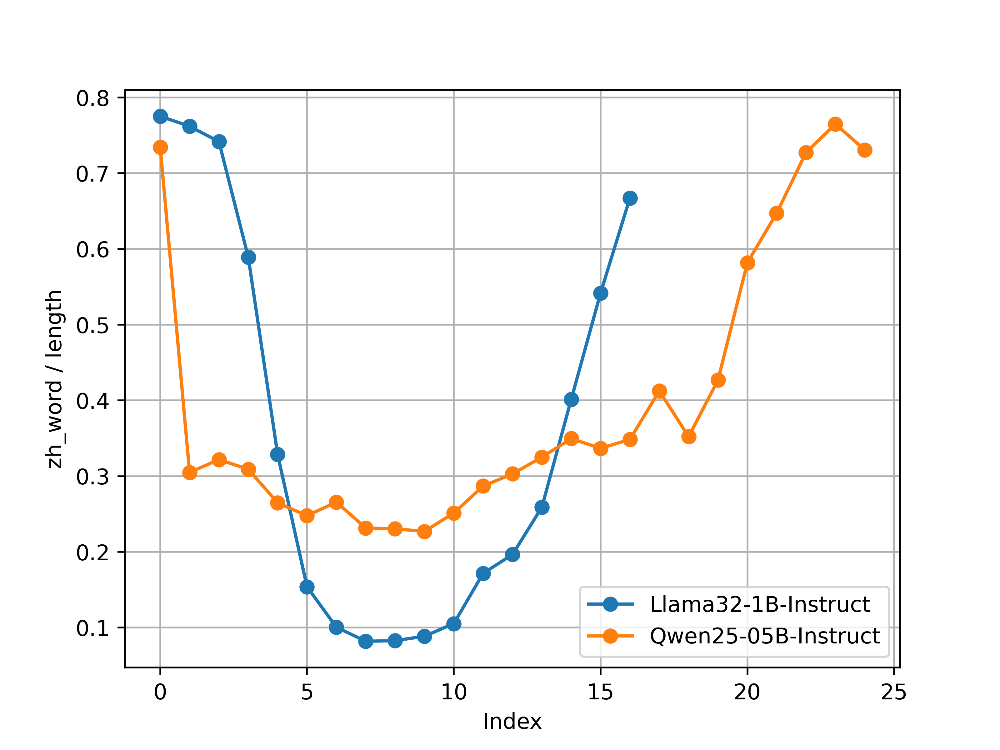

# SkipLayerCD

这是对于论文 [Multilingual Contrastive Decoding via Language-Agnostic Layers Skipping](https://arxiv.org/abs/2407.10795) 提及的解码方法的复现，官方仓库在[这里](https://github.com/njunlp/skiplayercd)

- `preview_v1.py`: 提供了不通过生成, 只统计给定 token 的 top1 预测的 token 是指定语言的概率
- `preview_v2.py`: 提供了对于生成文本的每个 token 是指定语言的概率, 并提供了 logits lens 的方法

logits lens: 例如对于 **Llama 3.2 1B** 模型 输入 "What is the capital of China?", 得到:


# OverView

关于这个 **Repo**，我主要尝试将 **skip_layer** 解码方法和[transformers](https://github.com/huggingface/transformers)自带的解码方法集成，Huggingface 已经集成了很多解码方法(可以参考[这里](https://huggingface.co/docs/transformers/main/en/generation_strategies#dola-decoding))，包括本实验需要的 **DoLa** 解码。

**一些贡献**

- 我关于 **skip_layer** 的代码集成于 `./utils/skip_layer.py`，并提供了 `sl_generate` 函数以供使用，它与我们经常使用的 `model.generate` 方法的不同处在于您需要在该函数的输入参数传入您的预训练模型(Decode-only)，并且考虑了 **skip_layer** 技巧。

> 选取合适的层进行 **skip** 非常困难，我参考原作者选取了 `sl-h` 方法，但是 `sl-d` 方法有所改动，我现在不确定改动是否合理。

- 此外，我尝试为 Q & A 这种任务设置一个评估器 class(`/utils/data_modules/module.py`)，并且创造了一个 [mgsm 数据集](https://huggingface.co/datasets/juletxara/mgsm) 的评估器(`/utils/data_modules/mgsm.py`)，这可能会为这类 benchmark 的评测提供一些方便。

**Think For A While**

事实上，我也类似作者，做了一些实验(`./preview.py`)，**logits lens** 的复现，我统计了 **Qwen2.5-0.5b** 以及 **Llama3.2-1b** 中，关于每层中文 token 出现的比例(**zh ratio**)，和每层的熵(**entropy**)，得到的结果为：




> Llama 模型并没有看起来和作者在 Mistral 7b 上的结果一致，可能是我的代码(**preview.py**) 实现问题，也有可能是预训练数据集的问题。


# How To Use

如果你需要在 `mgsm` 数据集上评估，首先需要在 [Huggingface](https://huggingface.co/datasets/juletxara/mgsm) 下载，然后按照 `eval.py` 的提示，更改一些参数，具体来说是：

```bash
python ./eval.py --model_path path_to_your_model \
    --data_path path_to_your_dataset \
    --dataset_name name_for_example_mgsm \
    --save_path path_to_your_log_file_path
    --generation_config see_config_sl_yaml_for_tip \
```

> 值得一提的是，因为我想构建一个通用的 Q&A 评估器，所以设置了参数 dataset_name 来匹配数据集到数据集评估器类的映射


